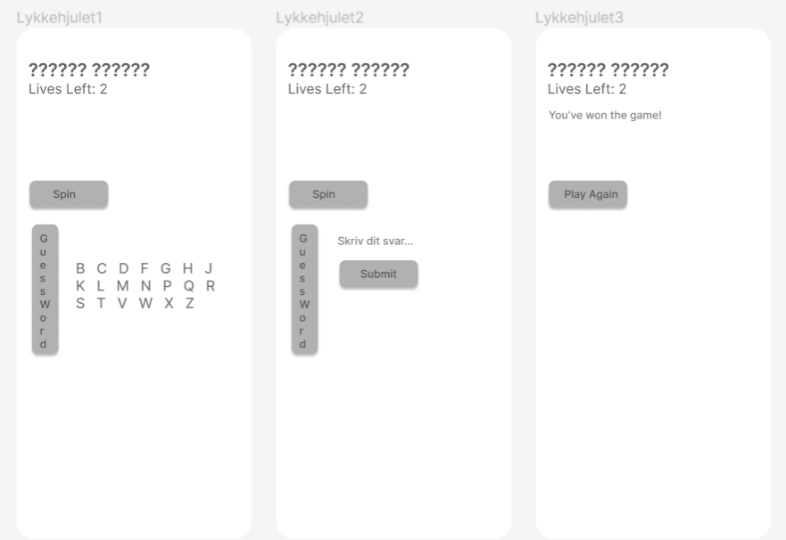

# android_individuel_aflevering

### Student: Azmi Uslu (s185736)
### Repo: https://github.com/s185736/android_exercises

### Lykkehjulet - s185736
Applikationen går ud på, at man skal klikke på en knap, som skal foretille sig, at være et lykkehjul. Som så giver x antal points.
Hovedformålet med spillet er, at man skal kunne gætte sig frem til ordet inden man mister alle sin 5 liv eller før det.

#### Prototype


#### Vejledning
- Start programmet.
- Klik på 'spin' for at starte dit første skridt.
- Man starter med 5 liv.
- Gæt dig frem til bogstaverne.
- Har du en ide på hvad det kan være? - Så skriv ved at trykke på 'Guess Word'.
- Efter 5. liv kommer der et resultat frem.

#### ORD
WordGenerator.kt
```
private val availableWords: List<String> = listOf("Android Studio", "IntelliJ Ultimate", "Machine Code", "Compiler Construction", "Innovation Pilot")
```


